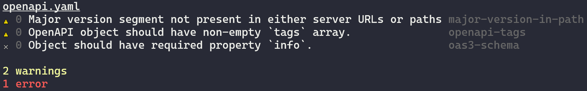

# pva

OpenAPI linter.



## Install

```sh
npm install pva
```

## Usage

```sh
$ pva <input...>
```

## Config

Whilst pva comes with a default configuration, you can configure it by providing options using one of these methods:

- A `pva` property in your `package.json`
- A `.pvarc` file in either JSON or YAML
- A `.pvarc.json`, `.pvarc.yaml`, `.pvarc.yml`, `.pvarc.js` or `.pvarc.cjs` file
- A `pva.config.js` or `pva.config.cjs` file

### Configuring rules

- [Spectral base rules](https://github.com/stoplightio/spectral/blob/develop/docs/reference/openapi-rules.md)
- [IBM validator rules](https://github.com/IBM/openapi-validator#definitions)
- [IBM custom Spectral rules](https://github.com/IBM/openapi-validator/blob/main/docs/spectral-rules.md)

Each rule can be configured with an alert level of either `error`, `warning`, `info` or `hint`. An `error` will cause pva to finish with an exit code of 1.

To configure any sort of Spectral rule, specify them within `spectral.rules` of the configuration. For example, to configure the `no-eval-in-markdown`, use this configuration:

```json
{
	"spectral": {
		"rules": {
			"no-eval-in-markdown": "error"
		}
	}
}
```

To configure an IBM validator rule, have the top level property be the spec and then the second level property be the category. For example, to configure the `unused_tag` property which has a spec of `shared` and a category of `operations`, use this configuration:

```json
{
	"shared": {
		"operations": {
			"unused_tag": "warning"
		}
	}
}
```

## Credits

CLI aesthetics inspired by [xo](https://github.com/xojs/xo).
